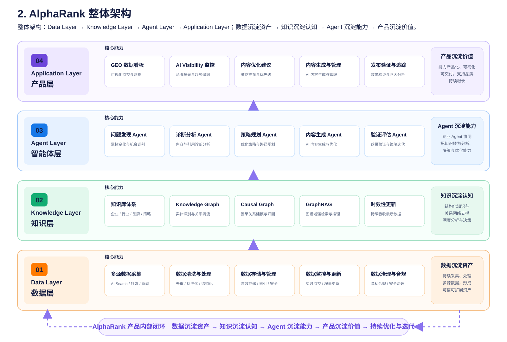
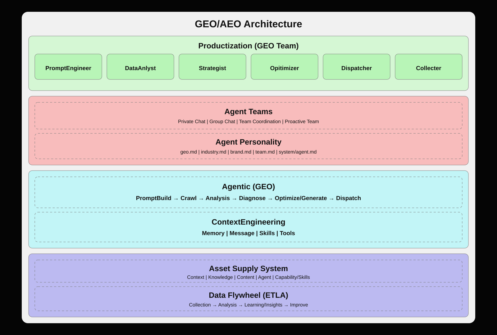
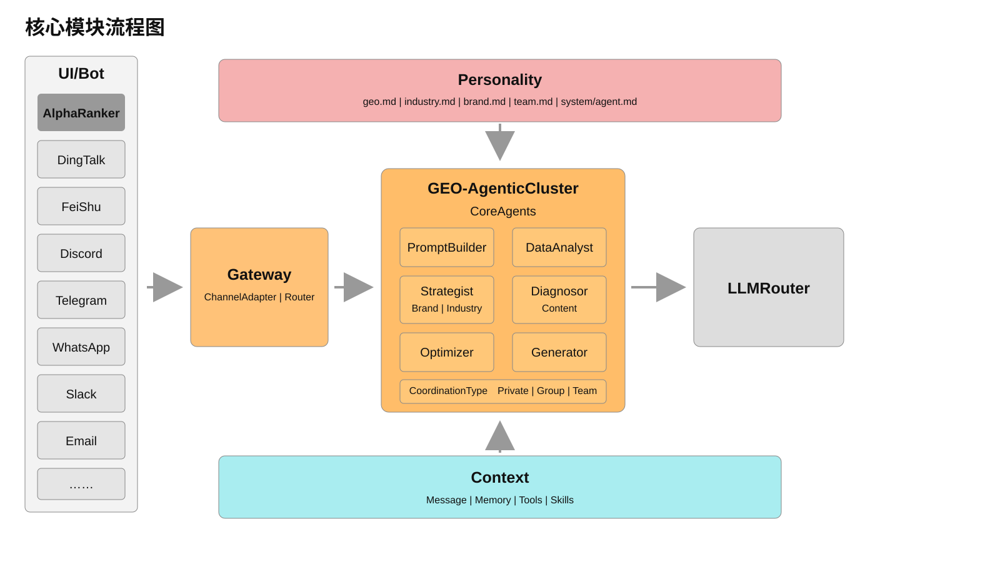
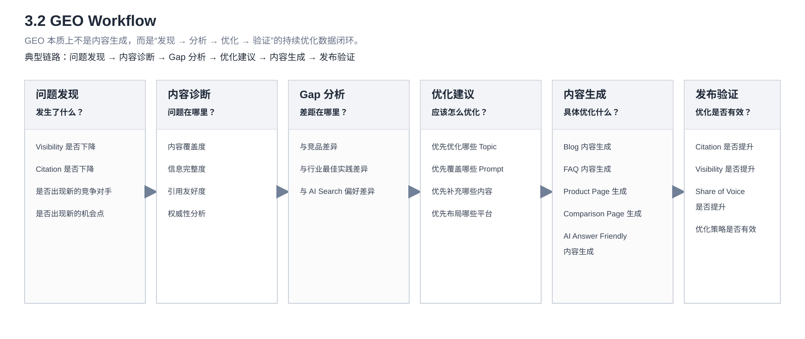
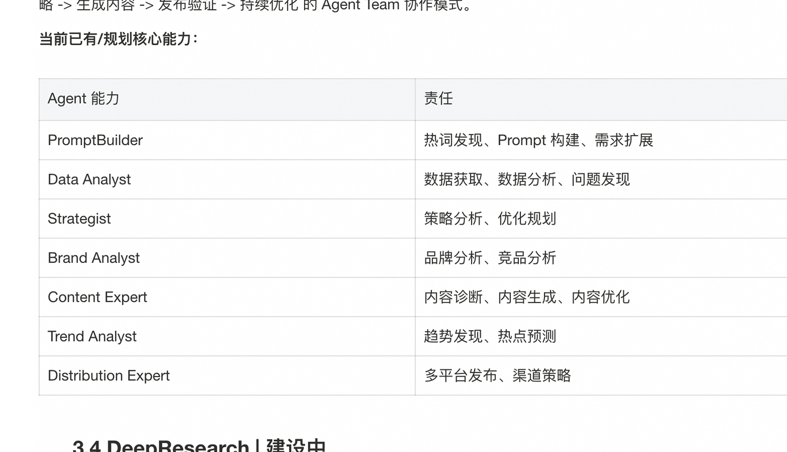
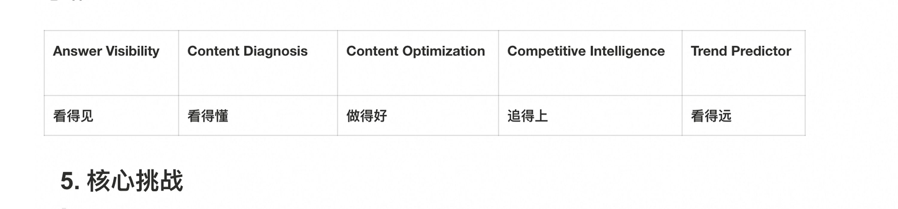

# AlphaRank GEO 全景说明｜忠实还原版

> [!info] 使用说明
> 本文按照原始长图从上到下还原。正文经过 OCR 后对照原图校正；4 张流程图按原布局与节点关系重绘为纯 SVG，并保留原始高清裁图作为核对证据；复杂表格同时保留原图与 Markdown 版本。每个主要内容块前的注释记录其在 7370 × 32768 原图中的像素范围。原始证据：[Group 123.png](source/Group%20123.png)。

<!-- source_region: x=2230,y=29,width=2700,height=6220; review=passed -->

## 1. 为什么 GEO 会成为新的增长入口

### 出现信号 / 催化剂

Perplexity 首次将“LLM + 实时搜索 + 引用来源 + 直接回答”组合成完整产品形态，这也是当前 AI Search 的标准范式。

大约从 2023 年 Q2/Q3 开始，AI Search 开始快速爆发，随后 Google 与 OpenAI 相继跟进：

- Perplexity（2023）——验证 AI Search 产品形态可行；
- Google AI Overview（2024）——验证搜索巨头开始全面转向 AI Search；
- ChatGPT Search（2024）——验证 AI Answer 正在成为新的信息入口。

从行业发展来看，搜索正在从 Search Engine（搜索引擎）向 Answer Engine（答案引擎）演进。

### 1.1 搜索范式变革（Search Engine → Answer Engine）｜用户获取信息的行为发生变化

传统 SEO 优化的是搜索排序（Ranking）。

搜索引擎通过爬取、索引、召回和排序机制，为用户返回最相关的网页结果。SEO 的核心目标是提升网页在搜索结果中的排名，从而获取更多曝光和点击流量。因此企业主要围绕关键词、内容质量、网站权重和技术 SEO 等方面进行优化。然而在 AI Search 时代，用户越来越多直接获取答案而非点击网页，优化目标也逐渐从“提升排名”转向“影响模型生成与引用”。

当前的 GEO（Generative Engine Optimization）优化的是 AI 的生成与引用过程（Generation & Citation），帮助品牌在 AI Search 场景中被发现（Discover）、被理解（Understand）、被引用（Citation）、被推荐（Recommend）。

**传统搜索链路：**

网页发现 → 网页爬取 → 页面解析 → 索引构建 → Query 理解 → 召回 → 排序 → SERP 展示

**核心目标：** 索引覆盖 → 排名提升 → 点击增长

**AI Search 链路：**

内容采集 → 知识索引 → Query 理解 → 检索召回 → Context 构建 → LLM 推理 → Answer 生成 → Citation 展示

**核心目标：** 内容被检索 → 内容被理解 → 内容被引用 → 品牌被推荐

**核心变化：**

1. 用户行为从“搜索结果点击”逐渐转向“直接获取答案”；
2. AI Answer 成为新的流量入口和决策入口；
3. 品牌竞争从 SEO Ranking 演进为 AI Citation Competition；
4. 企业缺少 AI Search 场景下的可观测与优化能力；
5. 内容优化目标从“获取点击”扩展为“影响模型认知”。

### 1.2 GEO 的本质

GEO/AEO：Generative / Answer / Agent Engine Optimization，目标是让品牌在 AI Search 中获得更高的可见度与影响力。

提升品牌在 AI Answer 中的：

1. Visibility（曝光）；
2. Citation（引用）；
3. Authority（权威度）；
4. Conversion（转化）。

简单用一句话总结：SEO 优化的是网页排名，GEO 优化的是 AI 对品牌的认知与推荐。

### 1.3 AlphaRank 解决什么问题

原图先出现一版 5 项简表，随后重复标题并扩展为完整问题清单。简表包含：

1. 目标用户关注什么问题？
2. 哪些 Topic 和 Prompt 具有增长机会？
3. GEO 指标怎么衡量？
4. 为什么竞品被引用 / 为什么我没被引用？
5. 如何提升引用率？

扩展清单为：

1. 目标用户关注什么问题？
2. 哪些 Topic 和 Prompt 具有增长机会？
3. GEO 指标怎么衡量？
4. 为什么竞品被引用 / 为什么我没被引用？
5. 如何提升引用率？
6. 哪些内容应该生成？
7. 哪些平台应该投放？
8. ……

这些问题本质上可以归纳为四类：

1. 机会发现；
2. 问题诊断；
3. 内容优化；
4. 效果验证。

结合上述问题，AlphaRank 会从如下 7 个环节形成产品逻辑，从而形成一个可持续优化的数据闭环产品：

数据监测 → 发现问题 → 分析问题 → 生成方案 → 执行优化 → 验证效果 → 持续优化

<!-- source_region: x=2150,y=6319,width=3600,height=4520; review=passed -->

## 2. AlphaRank 整体架构

整体架构：Data Layer → Knowledge Layer → Agent Layer → Application Layer；数据沉淀资产 → 知识沉淀认知 → Agent 沉淀能力 → 产品沉淀价值，最终形成 AlphaRank 的产品内部闭环。

[查看原始截图证据](assets/figures/figure-01-alpharank-layered-architecture.png)

图中四层及其核心能力：

1. **Data Layer / 数据层**：多源数据采集、数据清洗与处理、数据存储与管理、数据监控与更新、数据治理与合规；持续采集、处理与沉淀多源数据，形成可用、可信、可扩展的数据资产。
2. **Knowledge Layer / 知识层**：知识库体系、Knowledge Graph、Causal Graph（探索中）、GraphRAG、时效性更新；将数据转化为结构化知识与关系网络，形成系统认知，支撑深度分析与决策。
3. **Agent Layer / 智能体层**：问题发现 Agent、诊断分析 Agent、策略规划 Agent、内容生成 Agent、验证评估 Agent；通过多个专业 Agent 协同，将知识转化为可执行的分析、决策与优化能力。
4. **Application Layer / 产品层**：GEO 数据看板、AI Visibility 监控、内容优化建议、内容生成与管理、发布验证与追踪；将能力产品化、可视化、可交付，帮助品牌在 AI Search 中持续增长。

内部闭环：数据沉淀资产 → 知识沉淀认知 → Agent 沉淀能力 → 产品沉淀价值 → 持续优化与迭代。

### GEO/AEO Architecture

[查看原始截图证据](assets/figures/figure-02-geo-agentic-architecture.png)

该架构图包含：

- Productization（GEO Team）：PromptEngineer、DataAnlyst、Strategist、Opitimizer、Dispatcher、Collecter；
- Agent Teams：Private Chat、Group Chat、Team Coordination、Proactive Team；
- Agent Personality：`geo.md`、`industry.md`、`brand.md`、`team.md`、`system/agent.md`；
- Agentic（GEO）：PromptBuild → Crawl → Analysis → Diagnose → Optimize/Generate → Dispatch；
- ContextEngineering：Memory、Message、Skills、Tools；
- Asset Supply System：Context、Knowledge、Content、Agent、Capability/Skills；
- Data Flywheel（ETLA）：Collection → Analysis → Learning/Insights → Improve。

### 核心模块流程图

[查看原始截图证据](assets/figures/figure-03-left-runtime-detail.png)

图中从 UI/Bot（AlphaRanker、DingTalk、FeiShu、Discord、Telegram、WhatsApp、Slack、Email 等）进入 Gateway（ChannelAdapter / Router），再进入 GEO-AgenticCluster。CoreAgents 包含 PromptBuilder、DataAnalyst、Strategist（Brand / Industry）、Diagnosor（Content）、Optimizer、Generator；协作类型为 Private / Group / Team，并连接 LLMRouter。Personality 从上方注入，Context（Message / Memory / Tools / Skills）从下方供给。

<!-- source_region: x=2289,y=10989,width=2700,height=2200; review=passed -->

### 2.1 数据层（Data Flywheel Layer）

数据层是整个 AlphaRank 的基础设施层，负责构建 GEO 领域的数据资产与数据飞轮。核心目标：

1. 建立 AI Search 数据资产；
2. 建立 GEO 数据飞轮；
3. 建立统一的数据分析与观测体系。

主要数据来源：

1. AI Search：ChatGPT、Google AI Overview、Gemini、Perplexity、豆包、千问、DeepSeek 等；
2. 品牌数据：官网、Blog、Product Page、FAQ、Help Center；
3. 行业数据：Agent / 挖掘、行业网站、行业报告、社区内容；
4. 竞品数据：竞品官网、竞品内容、AI Search 表现。

核心能力：

1. 品牌数据采集；
2. 竞品数据采集；
3. 行业数据采集；
4. 数据清洗与结构化；
5. 数据分析与归因；
6. GEO 指标计算；
7. AB 实验与效果评估。

数据飞轮：Collect → Clean → Analyze → Insight → Optimize → Feedback → Train / SelfEvolution。

构建 ETAL 闭环，最终实现“数据 → 洞察 → 优化 → 数据”的持续增强循环链路。

<!-- source_region: x=2250,y=13309,width=2800,height=3020; review=passed -->

### 2.2 知识层（Knowledge Layer）

知识层是 AlphaRank 的认知中枢，负责将离散数据沉淀为可检索、可推理、可复用的知识资产（企业 / 品牌 / 行业 / Prompt / Strategy）。

以传统 RAG + GraphRAG 的方式构建整套知识体系，核心提供 3 个能力：

1. 构建多层次 GEO 知识底座；
2. 实现数据到知识的转化；
3. 支撑 Agent 推理与决策。

#### 知识分层

Raw → Processed → Insights

1. **RawData｜原始数据层**
   - AI Answer；
   - 网页内容；
   - 行业数据；
   - 用户数据。
2. **Processed｜结构化知识层**
   - Topic（主题）；
   - Keyword（关键词）；
   - Entity（实体）；
   - Relation（关系）；
   - Citation（引用关系）；
   - Strategy（使用策略）。
3. **Insights｜洞察资产层**
   - 品牌洞察；
   - 行业洞察；
   - 竞品洞察；
   - GEO 策略知识；
   - 最佳实践知识。

#### 知识图谱

在传统 RAG 基础上进一步引入知识图谱能力，帮助系统理解品牌与产品关系、品牌与竞品关系、Prompt 与 Topic 关系、行业趋势关联关系。

Raw Data → Entity / Relation Extraction → Knowledge Graph → GraphRAG → Agent Reasoning

1. Knowledge Graph：负责沉淀品牌、产品、行业、竞品、Topic、Prompt、Citation 之间的关系；
2. GraphRAG：负责在图谱关系基础上做检索增强，提升长尾问题发现、引用原因分析、趋势推理能力；
3. 后续会进一步结合 Causal Graph，从“关系分析”演进到“因果分析”。

<!-- source_region: x=2169,y=16339,width=5200,height=6520; review=passed -->

## 3. Agent 如何驱动 GEO 持续优化

如果说 Data Layer 解决的是数据问题，Knowledge Layer 解决的是认知问题，那么 Agent Layer 解决的是行动问题。AlphaRank 希望将 GEO 从“人工分析 + 人工执行”升级为“Agent 持续分析 + Agent 持续优化”。

### 3.1 为什么需要 Agent

**传统 SaaS 产品：**

用户提需求 → 用户分析 → 用户执行。

用户需要自己完成：数据查看 → 问题分析 → 内容规划 → 内容生成 → 效果验证。SaaS 工具提供基础能力，但不提供行动。

**Agentic SaaS：**

用户提目标 → Agent 分析 → Agent 规划 → Agent 执行 → Agent 验证。

用户只需要关注目标。Agent 会自动把目标拆解，将目标落地为数据分析 → 问题诊断 → 内容优化 → 效果验证等环节并执行。

核心目标：

- 将 GEO 能力 Agentic 化；
- 将 GEO 流程自动化；
- 将 GEO 经验沉淀为可复用能力。

当前主要能力：

- 数据分析；
- 内容诊断；
- 内容生成；
- 趋势分析；
- 自动优化（建设中）。

### 3.2 GEO Workflow

GEO 本质上不是内容生成，而是一个持续优化过程。因此 AlphaRank 首先需要定义一套标准化 GEO Workflow（发现 → 分析 → 优化 → 验证）的数据闭环链路。

典型链路：问题发现 → 内容诊断 → Gap 分析 → 优化建议 → 内容生成 → 发布验证。

[查看原始截图证据](assets/figures/figure-04-geo-workflow.png)

| 阶段 | 核心问题 | 具体内容 |
|---|---|---|
| 问题发现 | 发生了什么？ | Visibility 是否下降；Citation 是否下降；是否出现新的竞争对手；是否出现新的机会点 |
| 内容诊断 | 问题在哪里？ | 内容覆盖度；信息完整度；引用友好度；权威性分析 |
| Gap 分析 | 差距在哪里？ | 与竞品差异；与行业最佳实践差异；与 AI Search 偏好差异 |
| 优化建议 | 应该怎么优化？ | 优先优化哪些 Topic；优先覆盖哪些 Prompt；优先补充哪些内容；优先布局哪些平台 |
| 内容生成 | 具体优化什么？ | Blog 内容生成；FAQ 内容生成；Product Page 生成；Comparison Page 生成；AI Answer Friendly 内容生成 |
| 发布验证 | 优化是否有效？ | Citation 是否提升；Visibility 是否提升；Share of Voice 是否提升；优化策略是否有效 |

### 3.3 Agent Team｜建设中

Workflow 定义了事情怎么做，而 Agent Team 负责把 Workflow 自动执行出来。不同 Agent 对应 Workflow 中不同阶段的职责，通过协作完成完整 GEO 优化流程。

整体协作模式：目标输入 → Agent Team 协同 → 优化方案输出。未来希望形成“发现问题 → 分析问题 → 制定策略 → 生成内容 → 发布验证 → 持续优化”的 Agent Team 协作模式。

| Agent 能力 | 责任 |
|---|---|
| PromptBuilder | 热词发现、Prompt 构建、需求扩展 |
| Data Analyst | 数据获取、数据分析、问题发现 |
| Strategist | 策略分析、优化规划 |
| Brand Analyst | 品牌分析、竞品分析 |
| Content Expert | 内容诊断、内容生成、内容优化 |
| Trend Analyst | 趋势发现、热点预测 |
| Distribution Expert | 多平台发布、渠道策略 |

### 3.4 DeepResearch｜建设中

GEO 并不是简单的信息检索问题，而是一个需要持续探索、推理与验证的问题。因此 Agent 不仅需要获取信息，更需要具备研究与推理能力。

DeepResearch 的典型过程：搜索 → 分析 → 反思 → 再搜索 → 验证。

相比传统 Workflow“输入 → 工具调用 → 输出”，DeepResearch 更强调“探索 → 推理 → 验证”的能力。在当前场景下主要应用于：

- Citation 原因分析；
- 竞品策略分析；
- 行业趋势分析；
- Prompt 挖掘；
- 内容优化策略生成。

<!-- source_region: x=2179,y=23000,width=2900,height=5520; review=passed -->

## 4. AlphaRank 产品能力

AlphaRank 将 Data、Knowledge、Agent 能力产品化，帮助企业建立 GEO 持续优化体系。

### 4.1 Answer Visibility

回答“品牌当前在 AI Search 中表现如何”的问题：品牌是否被看见、在哪里被看见、为什么被看见。

核心能力：

1. AI Visibility 监测；
2. Citation 监测；
3. Share of Voice 分析；
4. 品牌曝光趋势分析。

### 4.2 Content Diagnosis｜部分能力建设中

回答“为什么被引用 / 为什么没有被引用”的问题：在内容侧是否有内容缺少、短板、机会等。

核心能力：

1. 内容覆盖度分析；
2. 信息完整度分析；
3. 引用友好度分析；
4. 品牌权威度分析。

### 4.3 Content Optimization

回答“如何提升 AI Search 表现”的问题，提升 Visibility、Citation、Authority。

核心能力：

1. 内容优化建议；
2. 优质内容生成；
3. Prompt 驱动内容生成；
4. 多场景内容生成。

### 4.4 Competitive Intelligence

回答“竞品为什么表现更好”的问题，帮助品牌发现竞品优势、内容差距、机会市场等。

核心能力：

1. 竞品监测；
2. Citation 对比分析；
3. Topic Gap 分析；
4. Content Gap 分析；
5. GEO 策略分析。

### 4.5 Trend Predictor

回答“未来应该做什么”的问题，主动发现机会、布局内容、获取流量等。

核心能力：

- 行业热点发现；
- Prompt 趋势分析；
- AI Search 趋势分析；
- 新兴机会发现。

### 产品能力总结

| Answer Visibility | Content Diagnosis | Content Optimization | Competitive Intelligence | Trend Predictor |
|---|---|---|---|---|
| 看得见 | 看得懂 | 做得好 | 追得上 | 看得远 |

<!-- source_region: x=2219,y=28409,width=2900,height=4359; review=passed -->

## 5. 核心挑战

GEO 并不是简单的内容生成或搜索优化问题，而是一个融合数据、知识、推理与评测的复杂系统工程。AlphaRank 在建设过程中主要面临四类核心挑战。

### 5.1 数据挑战

数据量巨大，平台众多，实时变化；GEO 场景天然具有来源分散、格式不统一、更新频繁、噪声较高等特点。

1. **数据采集**：当前数据采集平台覆盖国内外主流 AI Answer 引擎，不同引擎在获取方式、内容结构、风控策略上存在差异，如何提升数据采集稳定性是最底层需要解决的问题。
2. **数据质量**：数据采集稳定性、内容天然质量低等原因会导致数据重复、噪声、无效信息。
3. **数据归因**：如何构建一套可解释的 GEO 指标，例如为什么被引用、为什么没有引用、怎么提升，是持续探索和解决的核心挑战。
4. **数据一致性**：整体数据的清洗、展示、使用需要统一的数据口径。

### 5.2 Knowledge 挑战

整体知识体系不是一成不变的，而是持续变化的。需要寻找知识之间的复杂关联和知识背后的隐含因果关系。传统 RAG 只能帮助系统“得到知识”，但系统还需要理解知识、关联知识、推理知识。

1. **Knowledge Base**：持续沉淀 / 更新底层知识库信息，持续更新企业、品牌、行业、GEO 策略等知识；
2. **Knowledge Graph**：持续动态更新沉淀的关系网络，帮助系统理解品牌、产品、竞对、Topic、Citation 之间的关联关系；
3. **Causal Graph｜探索中**：在关系图基础上进一步引入因果关系，例如内容覆盖度提升 → Citation 提升 → Visibility 提升 → Conversion 提升；从简单相关性分析演化到因果分析，帮助品牌归因“为什么发生、什么因素导致、应该优化什么”，而不只是告知发生了什么；
4. **GraphRAG**：结合 Knowledge Graph、Vector Retrieval 与 LLM Reasoning，构建图谱增强检索能力，帮助系统发现长尾机会、行业趋势、理解 Citation 原因并支持 Agent 深度推理，实现从“检索知识”到“理解知识 → 关联知识 → 推理知识”的能力升级。

### 5.3 Agent 挑战

Agent 的加入增加了规划与决策过程，显著增加系统复杂度：

1. Agent 成功率；
2. Tool / Skill 的选择；
3. Memory 管理：需要同时管理用户、品牌、行业、历史偏好等信息，在长链路任务执行过程中保持信息不丢失；
4. Workflow Planning / Agent 协作：复杂 GEO 任务涉及任务拆解和角色协同，例如数据分析 → 策略规划 → 内容生成 → 效果验证；如何动态规划执行路径是 Agent 的通用问题。

### 5.4 Evaluation 挑战｜探索中

如何证明 GEO 优化不是“看起来变好了”，而是在真实 AI Search 场景中可量化、可归因、可持续验证地变好了。

1. **GEO 指标体系**：建立统一指标，包括 Visibility、Citation、Share of Voice、Authority、Conversion，但很多指标数据不一定能够获得；
2. **离在线评估**：评估策略是否有效、内容是否有效等；
3. **AB Test**：建立从实验设计、效果验证到自动归因的自动化数据闭环链路；在互联网环境中明确哪些策略、内容由系统生成，也是非常大的挑战。
