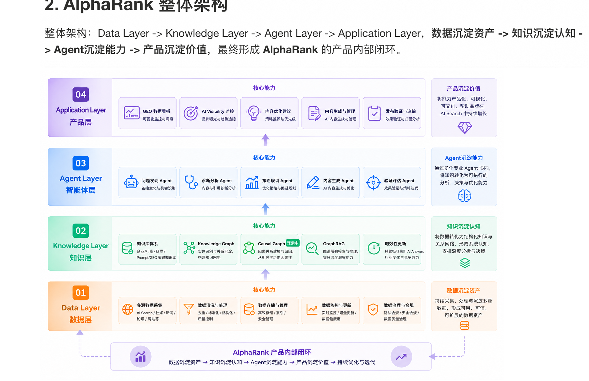
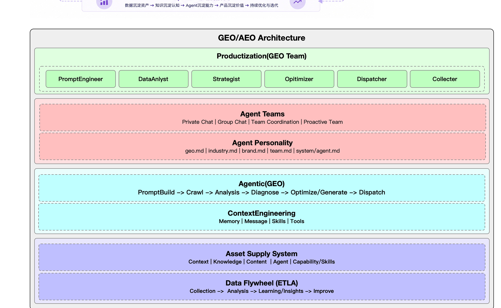
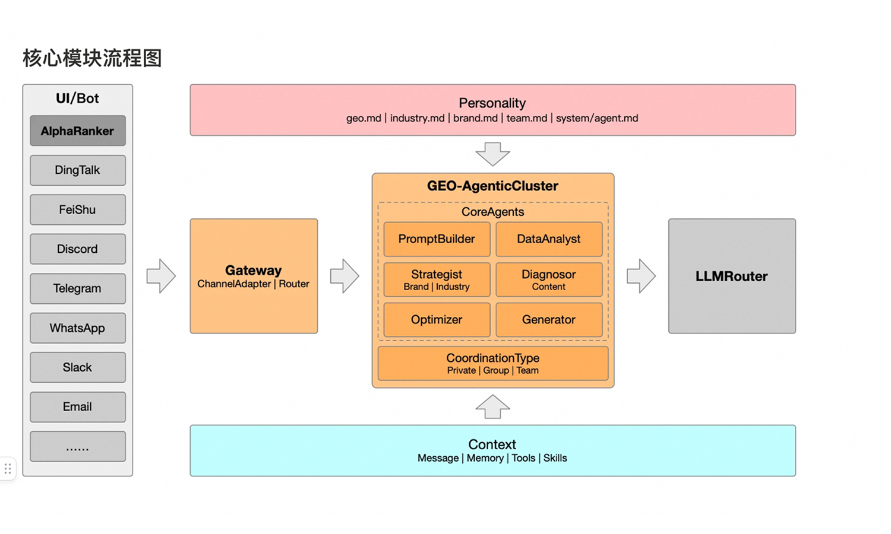
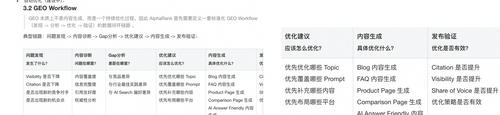

# AlphaRank GEO：从 AI Search 到 Agentic GEO 的产品全景

> [!summary] 一句话结论
> SEO 优化网页排名，GEO 优化 AI 对品牌的认知、引用与推荐。AlphaRank 试图用 Data → Knowledge → Agent → Application 四层架构，把“监测—诊断—优化—验证”做成持续运转的数据闭环。

## 阅读入口

- 本文：去除原图重复内容与画布噪声后的完整阅读版。
- [[faithful|忠实还原版]]：保持原图顺序，包含来源坐标和逐段核对结果。
- [原始长图](source/Group%20123.png)：最终核对依据。
- [[quality-report|质量报告]]：覆盖率、图表、OCR 与阻断项记录。

## 核心地图

| 问题 | AlphaRank 的回答 |
|---|---|
| 为什么需要 GEO？ | 用户从点击搜索结果转向直接获取 AI Answer，品牌竞争从 Ranking 转向 Citation Competition。 |
| GEO 优化什么？ | Visibility、Citation、Authority、Conversion。 |
| 产品如何运转？ | 数据监测 → 发现问题 → 分析问题 → 生成方案 → 执行优化 → 验证效果 → 持续优化。 |
| 技术底座是什么？ | Data Layer → Knowledge Layer → Agent Layer → Application Layer。 |
| Agent 的作用是什么？ | 把数据和知识转成持续分析、规划、执行和验证的行动能力。 |
| 最终产品能力是什么？ | Answer Visibility、Content Diagnosis、Content Optimization、Competitive Intelligence、Trend Predictor。 |

## 1. GEO：搜索竞争从排名转向模型认知

### 行业催化剂

- Perplexity（2023）把 LLM、实时搜索、来源引用和直接回答组合成完整产品形态；
- Google AI Overview（2024）说明传统搜索巨头开始转向 AI Search；
- ChatGPT Search（2024）说明 AI Answer 正在成为新的信息入口。

搜索范式由 Search Engine 向 Answer Engine 演进。

### 两条链路的差异

**传统搜索：**

网页发现 → 网页爬取 → 页面解析 → 索引构建 → Query 理解 → 召回 → 排序 → SERP 展示

目标是“索引覆盖 → 排名提升 → 点击增长”。

**AI Search：**

内容采集 → 知识索引 → Query 理解 → 检索召回 → Context 构建 → LLM 推理 → Answer 生成 → Citation 展示

目标是“内容被检索 → 内容被理解 → 内容被引用 → 品牌被推荐”。

### 五个核心变化

1. 用户从“搜索结果点击”转向“直接获取答案”；
2. AI Answer 成为新的流量入口和决策入口；
3. 品牌竞争从 SEO Ranking 演进为 AI Citation Competition；
4. 企业缺少 AI Search 场景下的可观测与优化能力；
5. 内容优化从“获取点击”扩展为“影响模型认知”。

### GEO 的目标

GEO/AEO（Generative / Answer / Agent Engine Optimization）要提升品牌在 AI Answer 中的：

- Visibility（曝光）；
- Citation（引用）；
- Authority（权威度）；
- Conversion（转化）。

### 企业问题清单

企业关心：目标用户关注什么、哪些 Topic / Prompt 有增长机会、GEO 指标如何衡量、竞品为什么被引用、如何提升引用率、生成哪些内容、在哪些平台投放等。这些问题归纳为机会发现、问题诊断、内容优化和效果验证四类。

## 2. AlphaRank 四层架构

| 层级 | 核心能力 | 沉淀结果 |
|---|---|---|
| Data Layer | 多源采集、清洗处理、存储管理、监控更新、治理合规 | 数据资产 |
| Knowledge Layer | 知识库、Knowledge Graph、Causal Graph、GraphRAG、时效更新 | 系统认知 |
| Agent Layer | 问题发现、诊断分析、策略规划、内容生成、验证评估 | 行动能力 |
| Application Layer | GEO 看板、AI Visibility、优化建议、内容生成管理、发布验证追踪 | 产品价值 |

内部闭环为：数据沉淀资产 → 知识沉淀认知 → Agent 沉淀能力 → 产品沉淀价值 → 持续优化与迭代。

### 2.1 数据层：建立数据资产与飞轮

目标：建立 AI Search 数据资产、GEO 数据飞轮，以及统一的数据分析与观测体系。

数据来源包括：

- AI Search：ChatGPT、Google AI Overview、Gemini、Perplexity、豆包、千问、DeepSeek 等；
- 品牌数据：官网、Blog、Product Page、FAQ、Help Center；
- 行业数据：Agent / 挖掘、行业网站、行业报告、社区内容；
- 竞品数据：竞品官网、竞品内容、AI Search 表现。

能力覆盖品牌、竞品和行业数据采集，数据清洗与结构化，数据分析与归因，GEO 指标计算，以及 AB 实验与效果评估。

数据飞轮：Collect → Clean → Analyze → Insight → Optimize → Feedback → Train / SelfEvolution，形成“数据 → 洞察 → 优化 → 数据”的持续增强循环。

### 2.2 知识层：从原始数据到可推理资产

知识层把离散数据沉淀为企业、品牌、行业、Prompt 和 Strategy 等可检索、可推理、可复用的知识资产。

| 层级 | 内容 |
|---|---|
| RawData | AI Answer、网页内容、行业数据、用户数据 |
| Processed | Topic、Keyword、Entity、Relation、Citation、Strategy |
| Insights | 品牌洞察、行业洞察、竞品洞察、GEO 策略知识、最佳实践知识 |

知识路径：Raw Data → Entity / Relation Extraction → Knowledge Graph → GraphRAG → Agent Reasoning。

- Knowledge Graph 沉淀品牌、产品、行业、竞品、Topic、Prompt、Citation 的关系；
- GraphRAG 在关系基础上增强检索，支持长尾问题发现、引用原因分析和趋势推理；
- Causal Graph 计划把能力从关系分析推进到因果分析。

### 2.3 Agentic 架构

该架构由 GEO Team、Agent Teams、Personality、Agentic 工作链、ContextEngineering、Asset Supply System 和 Data Flywheel 组成。

核心执行链：PromptBuild → Crawl → Analysis → Diagnose → Optimize / Generate → Dispatch。

上下文包含 Memory、Message、Skills、Tools；资产供给包含 Context、Knowledge、Content、Agent、Capability / Skills；数据飞轮为 Collection → Analysis → Learning / Insights → Improve。

多渠道请求从 UI/Bot 经 Gateway 路由到 GEO-AgenticCluster，由 PromptBuilder、DataAnalyst、Strategist、Diagnosor、Optimizer、Generator 等 Agent 协作，再通过 LLMRouter 调用模型。Personality 与 Context 分别提供角色约束和运行时信息。

## 3. Agent 驱动的持续优化

Data Layer 解决数据问题，Knowledge Layer 解决认知问题，Agent Layer 解决行动问题。目标是从“人工分析 + 人工执行”升级为“Agent 持续分析 + Agent 持续优化”。

### 传统 SaaS 与 Agentic SaaS

| 模式 | 路径 | 用户负担 |
|---|---|---|
| 传统 SaaS | 用户提需求 → 用户分析 → 用户执行 | 用户自己完成数据查看、问题分析、内容规划、生成和验证 |
| Agentic SaaS | 用户提目标 → Agent 分析 → 规划 → 执行 → 验证 | 用户主要关注目标与审核 |

Agentic 化要实现 GEO 能力 Agentic 化、流程自动化和经验能力化。当前能力包括数据分析、内容诊断、内容生成、趋势分析和建设中的自动优化。

### 标准 GEO Workflow

| 阶段 | 问题 | 观察或行动 |
|---|---|---|
| 问题发现 | 发生了什么？ | Visibility、Citation、竞争对手与机会点变化 |
| 内容诊断 | 问题在哪里？ | 覆盖度、完整度、引用友好度、权威性 |
| Gap 分析 | 差距在哪里？ | 对比竞品、行业最佳实践和 AI Search 偏好 |
| 优化建议 | 应该怎么优化？ | Topic、Prompt、内容与平台优先级 |
| 内容生成 | 具体优化什么？ | Blog、FAQ、Product Page、Comparison Page、AI Answer Friendly 内容 |
| 发布验证 | 优化是否有效？ | Citation、Visibility、Share of Voice 与策略效果 |

### Agent Team｜建设中

| Agent | 责任 |
|---|---|
| PromptBuilder | 热词发现、Prompt 构建、需求扩展 |
| Data Analyst | 数据获取、数据分析、问题发现 |
| Strategist | 策略分析、优化规划 |
| Brand Analyst | 品牌分析、竞品分析 |
| Content Expert | 内容诊断、内容生成、内容优化 |
| Trend Analyst | 趋势发现、热点预测 |
| Distribution Expert | 多平台发布、渠道策略 |

Agent Team 希望把目标输入转成协同执行与优化方案，最终形成“发现问题 → 分析问题 → 制定策略 → 生成内容 → 发布验证 → 持续优化”的协作模式。

### DeepResearch｜建设中

DeepResearch 强调“搜索 → 分析 → 反思 → 再搜索 → 验证”，不同于普通 Workflow 的“输入 → 工具调用 → 输出”。主要应用于 Citation 原因、竞品策略、行业趋势、Prompt 挖掘和内容优化策略分析。

## 4. 产品能力组合

| 模块 | 回答的问题 | 核心能力 |
|---|---|---|
| Answer Visibility | 品牌当前表现如何？ | AI Visibility、Citation、Share of Voice、品牌曝光趋势 |
| Content Diagnosis｜部分建设中 | 为什么被引用或没被引用？ | 覆盖度、完整度、引用友好度、品牌权威度 |
| Content Optimization | 如何提升 AI Search 表现？ | 优化建议、优质内容、Prompt 驱动、多场景生成 |
| Competitive Intelligence | 竞品为什么表现更好？ | 竞品监测、Citation 对比、Topic Gap、Content Gap、GEO 策略 |
| Trend Predictor | 未来应该做什么？ | 行业热点、Prompt 趋势、AI Search 趋势、新兴机会 |

产品心智：Answer Visibility“看得见”、Content Diagnosis“看得懂”、Content Optimization“做得好”、Competitive Intelligence“追得上”、Trend Predictor“看得远”。

## 5. 四类核心挑战

### 数据挑战

- **数据采集**：不同 AI Answer 引擎的获取方式、内容结构与风控策略不同；
- **数据质量**：采集不稳定和源内容质量会带来重复、噪声与无效信息；
- **数据归因**：需要解释为什么被引用、为什么没被引用以及如何提升；
- **数据一致性**：清洗、展示与使用需要统一口径。

### Knowledge 挑战

- Knowledge Base 要持续更新企业、品牌、行业和 GEO 策略；
- Knowledge Graph 要动态更新品牌、产品、竞对、Topic、Citation 的关系；
- Causal Graph（探索中）尝试建立“内容覆盖度 → Citation → Visibility → Conversion”的因果链；
- GraphRAG 结合 Knowledge Graph、Vector Retrieval 和 LLM Reasoning，从检索知识升级到理解、关联与推理知识。

### Agent 挑战

- Agent 成功率；
- Tool / Skill 选择；
- Memory 对用户、品牌、行业和历史偏好的长期管理；
- Workflow Planning 与多角色动态协作。

### Evaluation 挑战｜探索中

关键问题是证明 GEO 优化并非“看起来变好了”，而是在真实 AI Search 中可量化、可归因、可持续验证地改善。

- 统一 GEO 指标：Visibility、Citation、Share of Voice、Authority、Conversion，但部分数据未必可获得；
- 离线与在线评估：验证策略和内容是否有效；
- AB Test：打通实验设计、效果验证和自动归因，并识别哪些策略与内容由系统生成。

## 资料状态

- 本地状态：已重建，等待最终质量门确认；
- 飞书状态：未发布；
- 事实核对：以 [[faithful|忠实还原版]] 和 [原始长图](source/Group%20123.png) 为准。

